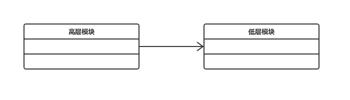
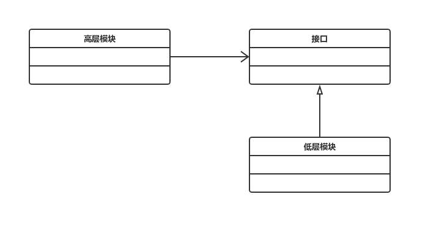

# ARTS-38 2019-05-04

> - Algorithm: 617. Merge Two Binary Trees
> - Review: The Principles of Good Programming
> - Tip: 再谈依赖倒置
> - Share: Don't Make Me Think

## Algorithm

```java
package org.nocoder.leetcode.solution;

/**
 * 617. Merge Two Binary Trees
 *
 * Given two binary trees and imagine that when you put one of them to cover the other,
 * some nodes of the two trees are overlapped while the others are not.
 *
 * You need to merge them into a new binary tree. The merge rule is that if two nodes overlap,
 * then sum node values up as the new value of the merged node. Otherwise, the NOT null node will be used as the node of new tree.
 *
 * Example 1:
 *
 * Input:
 * 	Tree 1                     Tree 2
 *           1                         2
 *          / \                       / \
 *         3   2                     1   3
 *        /                           \   \
 *       5                             4   7
 * Output:
 * Merged tree:
 * 	     3
 * 	    / \
 * 	   4   5
 * 	  / \   \
 * 	 5   4   7
 *
 *
 * Note: The merging process must start from the root nodes of both trees.
 * @author YangJinlong
 */
public class MergeTwoBinaryTrees {
    public TreeNode mergeTrees(TreeNode t1, TreeNode t2) {
        if (t1 == null) {
            return t2;
        }
        if (t2 == null) {
            return t1;
        }
        t1.val += t2.val;
        t1.left = mergeTrees(t1.left, t2.left);
        t1.right = mergeTrees(t1.right, t2.right);
        return t1;
    }

    class TreeNode{
        int val;
        TreeNode left;
        TreeNode right;

        public TreeNode(int val) {
            this.val = val;
        }
    }
}
```


## Review

### [The Principles of Good Programming](https://www.artima.com/weblogs/viewpost.jsp?thread=331531)

长久以来，不论是初出茅庐还是业界的老前辈，都依然强调着编程原则和设计原则。Bob大叔在他的《整洁架构之道》中提到，写这本书就是为了讲述这些规则，这些永恒的，不变的软件架构规则。

在学习各种编程原则的时候，看到了 Christopher Diggins 的这篇良好编程的原则，其中罗列了各种原则以及相应的链接，认为多年来这些编程原则帮助让其成为更好的程序员，且可以帮助任何开发人员来提高效率，写出更加易于维护、BUG更少的代码。

**DRY-Don‘t repeat yourself** - 这可能是编程中最基本的一个原则，就是避免重复。许多编程结构仅用于此目的（例如循环，函数，类等）。一旦你开始重复自己（例如一个长表达式，一系列语句，相同的概念），就创建一个新的抽象。 [http://en.wikipedia.org/wiki/Don%27t_repeat_yourself](http://en.wikipedia.org/wiki/Don't_repeat_yourself)

**抽象原则** - 与DRY相关的抽象原则是“程序中的每一个重要功能都应该在源代码中的一个地方实现”。<http://en.wikipedia.org/wiki/Abstraction_principle_(programming>）

**KISS（保持简单，愚蠢！）** - 简单（并避免复杂性）应始终是一个关键目标。简单的代码编写时间更短，错误更少，更容易修改。 <http://en.wikipedia.org/wiki/KISS_principle>

**避免创建 YAGNI（You aren‘t going to need it）** - 尝试在需要之前不添加功能。<http://en.wikipedia.org/wiki/YAGNI>

**做最简单的事可能有用** - 在编程时问一个人自己的一个好问题是“什么是最简单的事情可能有用？”这有助于我们在设计中走向简单化的道路。<http://c2.com/xp/DoTheSimplestThingThatCouldPossiblyWork.html>

**不要让我思考** - 这实际上是一本关于web可用性的书的标题，它也与编程有关。关键是代码应该易于阅读和理解，只需要最少的努力。如果代码需要阅读者过多的思考才能理解，那么它可能会还需要再被简化。 <http://www.sensible.com/dmmt.html>

**开闭原则** - 软件的类、模块、功能等应该对扩展开放，对修改关闭。换句话说，不要编写可以修改的类，而是编写可以扩展的类。<http://en.wikipedia.org/wiki/Open_Closed_Principle>

**为维护者编写代码** - 几乎所有值得编写的代码都值得在将来由你或其他人维护。未来你必须维护代码通常会记住尽可能多的代码，作为一个完全陌生的代码，所以你不妨总是为其他人写代码。记住这一点的一个令人难忘的方式是“总是编码，好像最终维护你的代码的人是一个知道你住在哪里的暴力精神病患者。“ <http://c2.com/cgi/wiki?CodeForTheMaintainer>

**最不惊讶**的原则 - **最不惊讶**的原则通常在用户界面方面被引用，但同样的原则适用于书面代码。代码应该尽可能少地让读者感到惊讶。遵循标准惯例的方法，代码应该做注释和名称所暗示的，并且应该尽可能避免可能出人意料的副作用。 <http://en.wikipedia.org/wiki/Principle_of_least_astonishment>

**单一责任原则** - 代码组件（例如类或函数）应执行单个定义良好的任务。 <http://en.wikipedia.org/wiki/Single_responsibility_principle>

**最小化耦合** - 代码的任何部分（代码块，函数，类等）应最小化对其他代码区域的依赖性。这是通过尽可能少地使用共享变量来实现的。“低耦合通常是结构良好的计算机系统和良好设计的标志，当与高内聚相结合时，支持高可读性和可维护性的一般目标” [http://en.wikipedia.org/wiki/Coupling_（ computer_programming](http://en.wikipedia.org/wiki/Coupling_(computer_programming)）

**最大化内聚** - 应在同一组件中找到具有类似功能的代码。 <http://en.wikipedia.org/wiki/Cohesion_(computer_science>）

**隐藏实现详细信息** - 隐藏实现详细信息允许更改代码组件的实现，同时最小化影响使用该组件的任何其他模块。 <http://en.wikipedia.org/wiki/Information_Hiding>

**迪米特法则** - 代码组件只应与它们的直接关系进行通信（例如它们继承的类，它们包含的对象，通过参数传递的对象等） <http://en.wikipedia.org/wiki/Law_of_Demeter>

**避免过早优化** - 除非你的代码有效，否则不要考虑优化，但要比你想要的慢。只有这样才能开始考虑优化，然后才能借助经验数据。“我们应该忘记小的效率，大约97％的时间说：过早的优化是所有邪恶的根源” - 唐纳德克努特。 <http://en.wikipedia.org/wiki/Program_optimization>

**重用代码** - 重用代码可提高代码可靠性并缩短开发时间。 <http://en.wikipedia.org/wiki/Code_reuse>

**关注点分离** - 不同的功能区域应该由不同且最小重叠的代码模块来管理。 <http://en.wikipedia.org/wiki/Separation_of_concerns>

**拥抱变化** - 这是Kent Beck的一本书的副标题，也被认为是极限编程和敏捷方法的一个原则。许多其他原则都基于您应该期待的概念并欢迎变革。事实上，最小化耦合等非常古老的软件工程原则与使代码更容易更改的要求直接相关。无论您是否是一名极限编程实践者，这种编写代码的方法都是有意义的。<http://www.amazon.com/gp/product/0321278658>

## Tip

### 再谈依赖倒置

- 高层模块不应该依赖底层模块。两个都应该依赖抽象。
- 抽象不应该 依赖细节，细节应该依赖抽象。

依赖倒置，究竟是什么发生了倒置呢？

这要从软件模块的层次说起，我们在做项目时，会写很多的低层方法，例如访问数据库、处理某个业务的逻辑等等。再由高层的模块去调用这些方法。这就叫做高层次依赖低层次。



一旦低层模块需要修改或更换，那么高层模块必然也要随之修改，两者的是高度耦合的，这种对于低层次组件的依赖限制了高层组件被重用的可行性。如果将高层组件依赖于抽象的接口或者抽象类，根据里氏替换原则，使用父类的地方都可以用子类来替换。这样就可以将高层组件和低层组件进行解耦，便于重用不同层级的组件，降低软件的维护成本，更加灵活。



依赖倒置可以说是面向对象设计的标志，编程时要考虑针对抽象编程而不是针对细节编程，即程序中所有的依赖关系都终止与抽象类或者接口。


## Share

### Don't make me think

http://www.sensible.com/dmmt.html

> 《Don't Make Me Think》适合从事Web设计和Web开发的技术人员阅读，特别适合为如何留住访问者苦恼的网站/网页设计人员阅读。可用性设计是Web设计中最重要也是难度最大的一项任务。本书作者根据多年从业的经验，剖析用户的心理，在用户使用模式、为扫描进行设计、导航设计、主页布局、可用性测试等方面提出了许多独特的观点，并给出了大量简单、易行的可用性设计的建议。本书短小精练，语言轻松诙谐，书中穿插大量色彩丰富的屏幕截图、趣味丛生的卡通插图以及包含大量信息的图表，使枯燥的设计原理变得平易近人。

虽然是关于web可用性的一本书，但道理都是相同的，也可以用于编程。代码应该易于阅读和理解，只需要最少的努力。如果代码需要阅读的人过多的思考才能理解，那么它可能会还需要再被简化。